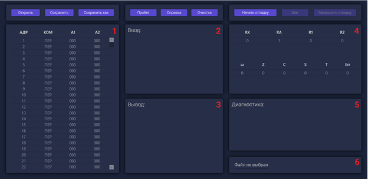
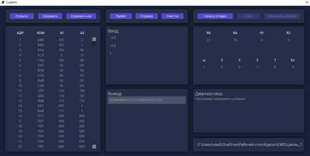

# Computing-machine-emulator
A custom educational computer was developed based on the von Neumann architecture, with a set of instructions designed and implemented to enable input and output of data, perform arithmetic operations (addition, subtraction, multiplication, division, and remainder calculation), as well as other commands to transfer data between memory locations, among other functions. All instructions execute sequentially, except for conditional and unconditional branching instructions, which can modify the program flow.

## Interface demo
### Main window

#### Description:
1 — A code table where users can input and edit program commands. Users can enter both integers and floating-point numbers. During program execution in normal or debug mode, the code table is locked for editing. The ability to modify the code is restored after the execution of the running program is completed.

2 — While the program is running, using the appropriate user-defined commands in the code table, the program may prompt the user to input data (integer or floating-point numbers). A window will appear where the user can enter the number using the keyboard. If an incorrect value is entered or the input operation is canceled, the program will terminate abruptly and notify the user. If the entered value is valid, the program will continue its execution, and the entered number will be displayed in the "Input Data" window. This allows users to recall the data they entered in the program.

3 — The program's output can be an integer or a floating-point number. To achieve this, the necessary command should be specified in the instructional machine, and the number will be displayed in the "Output" window.

4 — The interface includes a register and flag panel that changes during program execution. In the step-by-step mode, this panel visually demonstrates the program execution process.

5 — During program execution in the instructional machine, certain warnings, remarks, or unforeseen situations may arise. In such cases, all program-generated messages will be displayed in the "Diagnostics" window.

6 — This panel displays the path to the currently opened file.

7 — At the top of the window, there are auxiliary and control buttons: "Save," "Save As," "Open," "Help," and "Clear." The "Run" button executes the program, "Start Debugging" begins the step-by-step execution of the program, "Step" moves to the next command, and "End Debugging" terminates the step-by-step execution of the program.

### Help window

## Calculating demo
### WolframAlpha result

### Machine result

